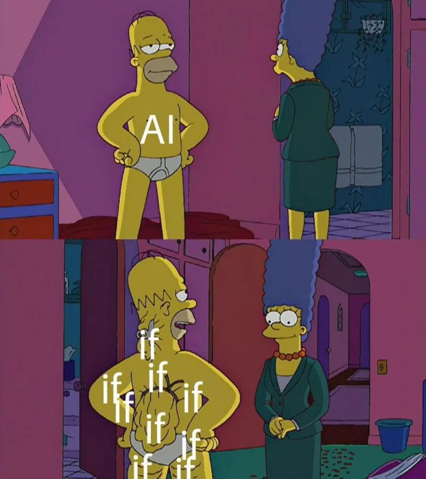

# Age of AI 
Pojď si zahrát legendární strategii Age of Empires II, naučit se základy programování a zjistit, jak funguje umělá inteligence ve hrách. Na konci akce se utkáš s ostatními účastníky v epickém souboji vašich civilizací.


## Instalace Age of Empires 2
Stažení a nainstalace ze [Steamu](https://store.steampowered.com/app/813780/Age_of_Empires_II_Definitive_Edition/).

## Scriptování AI


Jak se nyní dozvíte, tak naše AI není "Artificial Intelligence", ale "Accumulated IFs". Všechny AI v Age of Empires 2 jsou napsané v jazyce [LISP](https://cs.wikipedia.org/wiki/Lisp). LISP je velmi starý jazyk, který byl vytvořen v roce 1958. 

### jak definovat pavidlo (IFs)

Základem je podmíněné vykonávání příkazů IF -> THEN.

``` LISP
(defrule       ;Toto začíná pravidlo. Defrule je zkratka pro "definovat pravidlo".
    (fact 1)   ;Toto je "if" část pravidla. AI zkontroluje, zda jsou tato fakta
    (fact 2)   ;pravdivá. Pokud jsou všechny fakty pravdivé, pokračuje AI na
    (fact 3)   ;akce. Ne všechna pravidla mají 3 fakty, ale všechna mají alespoň jeden.
    ...
=>             ;Toto je "then" část pravidla.
    (action 1)
    (action 2) ;Pokud jsou všechny fakty pravdivé, dojde k těmto akcím. Ne všechna 
    (action 3) ;pravidla mají tři akce, ale všechna mají alespoň jednu.
    ...
) ;tato závorka ukončuje pravidlo.
```

Povšimněte si, že všechny odsazení jsou zcela volitelná. Byly zahrnuty pouze proto, aby bylo každé pravidlo snazší číst.

#### Jednorázové akce
Pokud chce pravidlo psouštět pouze jednou (disable-self action). Například při jednorázovém nastavení proměnné.

``` LISP
(defrule 
    (true) ; Toto pravidlo se spustí vždy, když je AI spuštěna.
=>
    (set-strategic-number sn-enable-boar-hunting 1) ; Zapnutí lovu divokých prasat. 
    (disable-self)
)
```

### Konstatny a proměnné (const & goals)

#### Konstanty

V AI obvykle raději používáme jména než čísla. To počítači nepomáhá, ale nám, abychom pochopili, co se v kódu děje.

Pokud chceme číslo uložit nod nějakým jménem, můžeme použít `defconst`:

``` LISP
(defconst my-number 5)
```

To znamená, že kdykoli napíšeme `my-number`, hra to bude interpretovat jako `5`.

#### Cíle (Goals)
Pokud chceme s našimi AI dělat něco opravdu složitějšího, musíme být schopni si pamatovat určitá čísla. `defconst` nám ale nepomůže, protože takové číslo nelze změnit. Zde přichází do hry systém cílů.

Akce typu Goal se definuje následovně:

``` LISP
(set-goal GOAL_NUMBER VALUE)
```

Nejsme však blázni aby jsme číslům přiřaozovali další hodnoty. Člověk zde na to může nahlížet jako na pole, kde `GOAL_NUMBER` je index a `VALUE` je hodnota na daném indexu. 

Pro snadnější práci by jsme v jazycích typu C použili kontrukci zvanou jako výčet (enumarate), zde nic takového sice není, ale můžeme to napodobit pomocí `defconst`, kdy jednotlivým konstantám přiřadíme čísla ručně.


``` LISP
(defconst gl-train-militia 1) ; Nastavi goal gl-train-militia na 1
(defconst gl-train-archers 2) ; Nastavi goal gl-train-archers na 2

; Nastavi pocatecni hodnotu cile na 0
(defrule
    (true)
=>
    (set-goal gl-train-militia 0)
    (set-goal gl-train-archers 0)
    (disable-self)
)

; Nekde hloubeji v kodu jsme se rozhodli, ze chceme nastavit cil gl-train-militia na 1 a tim povolit trenovani vojaku
(defrule
    (goal gl-train-militia 1)
    (can-train militiaman-line)
=>
    (train militiaman-line)
)
```

### Boolovské operátory (AND, OR, NOT)


Pro návrh složitějších pravidel lze jednotlivé výrazy spojovat pomocí boolovských operátorů. Existují zde tři boolovské operátory: `OR`, `AND` a `NOT`:

- `OR` "nebo" bere dvě podmínky. Podmínka může být další boolovský výraz nebo výrok.
- `AND` "a" také bere dvě podmínky a jeho jediným účelem je být použita v ORu.
- `NOT` "nikoli" bere pouze jednu podmínku a je pravdivá, pokud je podmínka nepravdivá.

``` LISP
(defrule
    (or
        (condition 1)
        (condition 2)
    )
=>
    (action)
)

(defrule
    (or
        (condition 1)
        (and
            (condition 2)
            (condition 3)
        )
    )
=>
    (action)
)

(defrule
    (not
        (condition)
    )
=>
    (action)
)
```

### Stavění

#### Domečky
Domečky nám umožnují vyrábět další vesničany. Pro kotrolu, zda jsme méně než 5 jednotek od stavu, kdy nemáme dostatek domů:

``` LISP
(housing-headroom < 5)
```

Následující příkaz nám umožní zkontrolovat zda máme dostatek domů na to, abychom podporovali maximální populaci. 

``` LISP
(population-headroom != 0)
```


Výsledný kód může vypadat takto:

``` LISP
(defrule
    (housing-headroom < 5)
    (population-headroom != 0)
    (can-build house)
=>
    (build house)
)
```

### Boj


předklad:


### Přidání AI scriptu do hry


Nyní jste pravděpodobně netrpěliví, abyste své pravidlo chování otestovali. Nejprve musíte svou AI uložit. Po té co jste pro ní vybrali jméno, uložte soubor s příponu `.per`. Všechny AI jsou uloženy ve složce AI. Přejděte do adresáře `My Computer/Local Disk (C)/Program Files/Microsoft Games/Age of Empires II/AI/` a do této složky uložte svou AI. 

Dále vytvořte nový prázdný dokument a ten pojmenujte stejným názvem jako vaši AI, ale s příponou `.ai` místo `.per`.

Tedy názvy vašich dvou souborů mohou být:

- `Moje_AI.per`
- `Moje_AI.ai`

Soubor `.per` obsahuje veškerý kód, který hra čte. Hra však potřebuje soubor `.ai`, aby mohla otevřít soubor AI. Takže každý soubor AI, který vytvoříte, bude potřebovat dva soubory, jeden s příponou `.per` a jeden s příponou `.ai`.

Nyní, abyste viděli svou AI v akci, otevřete Age of Empires a připravte se na spuštění náhodné mapové hry. Chcete-li se svou AI hrát v náhodné hře, klikněte na šipku vlevo od vašeho hráčského souboru a vyberte název zvolené AI.

## Demo soubory
Zde je jednoduchý příklad AI scriptu, na kterém můžte stavět:

- [basic.ai](./src/basic.ai)
- [basic.per](./src/basic.per)

## Zdroje:
- [Creating simple AI scripts for your custom campaigns](https://forums.ageofempires.com/t/creating-simple-ai-scripts-for-your-custom-campaigns/210881)
- [A guide to scripting your own AI for AOEII HD](https://steamcommunity.com/sharedfiles/filedetails/?id=1238296169)
- [AI Scripting Encyclopedia](https://airef.github.io/)
- [YouTube : aoe2 ai scripting tutorial](https://www.youtube.com/playlist?list=PL8UM8VqZhE0tRwdn-uvTUSvugUOArNc_j)