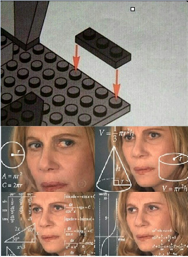

# Age of AI 
Pojď si zahrát legendární strategii Age of Empires II, naučit se základy programování a zjistit, jak funguje umělá inteligence ve hrách. Na konci akce se utkáš s ostatními účastníky v epickém souboji vašich civilizací.


- Vícuc zdrojů ke hře [AoE2](AoEIIDE.md).
- Pokud chcete programovat scripty jako programátor, tak můžete využít [Visual Studio Code](https://code.visualstudio.com/).
  - Vhodným rozšířením pak je [AoE2 AI Scripting](https://marketplace.visualstudio.com/items?itemName=knightthyme-tools.aoe2-aiscript). Ten posktuje základní syntaxi a validaci kódu.

## Instalace Age of Empires 2
### Nákup hry
Následující návod využívá Steam, což je aplikace pro nákup her. Pokud chcete koupit hru jiným způsobem, určitě to není problém, akorát vám pro to neposkytneme návod.
1. Stáhněte si [Steam](https://store.steampowered.com/) a vytvořte si účet.
2. Kupte si a nainstalujte Age of Empires II: Definitive Edition [dze](https://store.steampowered.com/app/813780/Age_of_Empires_II_Definitive_Edition/). 

## Scriptování AI


Jak se nyní dozvíte, tak naše AI není "Artificial Intelligence", ale "Accumulated IFs". Všechny AI v Age of Empires 2 jsou napsané v jazyce [LISP](https://cs.wikipedia.org/wiki/Lisp). LISP je velmi starý jazyk, který byl vytvořen v roce 1958. 

### Jak definovat pavidlo (IFs)

Základem je podmíněné vykonávání příkazů IF -> THEN. To pro nás bude $Alfa$ a $Omega$ celého scriptování. Je důležité pochopit následůjící část kódu, protže od teň na ní budeme pořád stavět. 

``` LISP
(defrule       ;Toto začíná pravidlo. Defrule je zkratka pro "definovat pravidlo".
    (fact 1)   ;Toto je "if" část pravidla. AI zkontroluje, zda jsou tato fakta
    (fact 2)   ;pravdivá. Pokud jsou všechny fakty pravdivé, pokračuje AI na
    (fact 3)   ;akce. Ne všechna pravidla mají 3 fakty, ale všechna mají alespoň jeden.
    ...
=>             ;Toto je "then" část pravidla.
    (action 1)
    (action 2) ;Pokud jsou všechny fakty pravdivé, dojde k těmto akcím. Ne všechna 
    (action 3) ;pravidla mají tři akce, ale všechna mají alespoň jednu.
    ...
) ;tato závorka ukončuje pravidlo.
```


Povšimněte si, že všechny odsazení jsou zcela volitelná. Byly zahrnuty pouze proto, aby bylo každé pravidlo snazší číst.

#### Jednorázové akce
Pokud chceme pravidlo pouštět pouze jednou (disable-self action). Například při jednorázovém nastavení proměnné.

``` LISP
(defrule 
    (true) ; Toto pravidlo se spustí vždy, když je AI spuštěna.
=>
    (set-strategic-number sn-enable-boar-hunting 1) ; Zapnutí lovu divokých prasat. 
    (disable-self)
)
```

### Konstatny a proměnné (const & goals)

#### Konstanty

V AI obvykle raději používáme jména než čísla. To počítači nepomáhá, ale nám, abychom pochopili, co se v kódu děje.

Pokud chceme číslo uložit nod nějakým jménem, můžeme použít `defconst`:

``` LISP
(defconst my_number 5)
```

To znamená, že kdykoli napíšeme `my_number`, hra to bude interpretovat jako `5`.

#### Cíle (Goals)
Pokud chceme s našimi AI dělat něco opravdu složitějšího, musíme být schopni si pamatovat určitá čísla. `defconst` nám ale nepomůže, protože takové číslo nelze změnit. Zde přichází do hry systém cílů.

Akce typu Goal se definuje následovně:

``` LISP
(set-goal GOAL_NUMBER VALUE)
```

Nejsme však blázni abychom číslům přiřazovali další hodnoty. Člověk zde na to může nahlížet jako na pole, kde `GOAL_NUMBER` je index a `VALUE` je hodnota na daném indexu. 

Pro snadnější práci bychom v jazycích typu C použili kontrukci zvanou jako výčet (enumarate), zde nic takového sice není, ale můžeme to napodobit pomocí `defconst`, kdy jednotlivým konstantám přiřadíme čísla ručně.



``` LISP
(defconst gl-train-militia 1) ; Nastavi constantu gl-train-militia na 1
(defconst gl-train-archers 2) ; Nastavi constantu gl-train-archers na 2

; Nastavi pocatecni hodnotu cile na 0
(defrule
    (true)
=>
    (set-goal gl-train-militia 0) ; Nastavi cile gl-train-militia na 0
    (set-goal gl-train-archers 0) ; Nastavi cile gl-train-archers na 0
    (disable-self)
)

; Nekde hloubeji v kodu jsme se rozhodli, ze chceme nastavit cil gl-train-militia na 1 a tim povolit trenovani vojaku
(defrule
    (goal gl-train-militia 1) ; Zkontroluje, zda je cil gl-train-militia roven 1
    (can-train militiaman-line)
=>
    (train militiaman-line)
)
```

**Pozor!** Cíle jsou vždy inicializovány na $-1$ a může jich být nastaveno pouze $512$ a mohou nabývat hodnot 32-bit integeru.

### Boolovské operátory (AND, OR, NOT)


Pro návrh složitějších pravidel lze jednotlivé výrazy spojovat pomocí boolovských operátorů. Existují zde tři boolovské operátory: `OR`, `AND` a `NOT`:

- `OR` "nebo" bere dvě podmínky. Podmínka může být další boolovský výraz nebo výrok.
- `AND` "a" také bere dvě podmínky a jeho jediným účelem je být použita v ORu.
- `NOT` "nikoli" bere pouze jednu podmínku a je pravdivá, pokud je podmínka nepravdivá.

**Pozor**! OR smí mít jen dva prvky! Pokud chcete použít více než dvě podmínky, musíte použít další vnořený OR.

``` LISP
(defrule
    (or ; Toto pravidlo se spustí, pokud je pravdivá jedna z následujících podmínek:
        (condition 1)
        (condition 2)
    )
=>
    (action)
)

(defrule
    (or
        (condition 1)
        (and
            (condition 2)
            (condition 3)
        )
    )
=>
    (action)
)

(defrule
    (not
        (condition)
    )
=>
    (action)
)
```

#### Porovnávání ve výrazech

Výrazy mohou být také porovnávány pomocí následujících operátorů:

- `>` (greater than) větší než
- `<` (less than) menší než
- `>=` (greater than or equal to) větší nebo rovno než
- `<=` (less than of equal to) menší nebo rovno než
- `==` (equal to) rovno

Příklad:

``` LISP
(defrule
    (unit-type-count villager > 0)
=>
    (chat-to-all "I just made my first villager!")
    (disable-self)
)
```

Podrobný návod pro porovnávání konstant, cílů a strategiských čísel je [zde](https://airef.github.io/parameters/parameters-details.html#compareOp).

### Micro management (Strategic Numbers)
Strategic number říkají AI, jak se chovat na nejzákladnější úrovni. Jsou převážně používány k přidělování vesničanů k různým zdrojům:

``` LISP
(defrule
    (current-age == dark-age)
=>
    (set-strategic-number sn-food-gatherer-percentage 85)
    (set-strategic-number sn-wood-gatherer-percentage 15)
    (set-strategic-number sn-gold-gatherer-percentage 0)
    (set-strategic-number sn-stone-gatherer-percentage 0)
    (disable-self)
)
```

Význam tohoto pravidla je: "Pokud je aktuální věk temný věk, pak přiřaďte 85% vesničanů k jídlu a 15% k dřevu. Udělejte to pouze jednou."

### Stavění budov

Pro postavení jakékoliv budovy můžeme použít podmínku:

``` LISP
(can-build BUILDING)
```

A následně akci:

``` LISP
(build BUILDING)
```

Například, pro postavení hradu můžeme použít:

``` LISP
(defrule
    (can-build castle)
=>
    (build castle)
)
```

Je také důležité poznamenat, že můžeme budovu postavit dopředu směrem k nepříteli pomocí příkazu `build-forward` místo pouhého `build`.

Můžeme zkontrolovat, kolik budov každého typu máme pomocí této podmínky:

``` LISP
(building-type-count-total BUILDING > NUMBER)
```

Všimněte si, že rozdíl mezi počtem budov a celkovým počtem budov je v tom, že ten druhý zahrnuje budovy ve frontě pro stavbu. (stejně to je i pro počty jednotek)

#### Domečky
Domečky nám umožnují vytvářet další vesničany. Pro kotrolu, zda jsme méně než 5 jednotek od stavu, kdy nemáme dostatek domů:

``` LISP
(housing-headroom < 5)
```

Následující příkaz nám umožní zkontrolovat zda máme dostatek domů na to, abychom podporovali maximální populaci. 

``` LISP
(population-headroom != 0)
```

Výsledný kód může vypadat takto:

``` LISP
(defrule
    (housing-headroom < 5)
    (population-headroom != 0)
    (can-build house)
=>
    (build house)
)
```

#### Skladiště (Dropoff points)

Kempy se staví stejně jako jakákoliv jiná budova, ale stejně jako domy, chceme je stavět pouze tehdy, když jsou splněny určité podmínky. Tato podmínka je užitečná:

``` LISP
(dropsite-min-distance RESOURCE > NUMBER_TILES)
```

Toto zkontroluje, zda je nejbližší `RESOURCE` (surovina) vzdálena více než `NUMBER_TILES` (počet kroků) od bodu dropoff. Další užitečnou podmínkou je:

``` LISP
(resource-found RESOURCE)
```

To ověří, zda AI prozkoumala konkrétní zdroj [surovin](AoEIIDE.md#suroviny). Nechceme stavět body dropoff pro zdroj, který neexistuje!

Zde je příklad pro tábor na dřevo, který by měl věci ujasnit:

``` LISP
(defrule
    (dropsite-min-distance wood > 3)
    (resource-found wood)
    (can-build lumber-camp)
=>
    (build lumber-camp)
    (up-modify-sn sn-camp-max-distance c:+ 3)
)
```

AI nebude sbírat suroviny, když jsou příliš daleko, i když jim doma došly, což nechceme. Jednoduchým řešením, které rád používám, je upravit `sn-camp-max-distance`, kdykoli postavím tábor.


### Boj
Pro vytvoření armády musíte:
1. Získat potřebnou dobu
2. Postavit příslušné budovy kasáren
3. Začít verbovat kýžené jednotky
4. Volitelným bodem je vyzkoumat technologie, které vylepší vaši armádu

#### Jednotky (Units)
Ve hře je několik různých jednotek a jsou pro ně potřeba různé budovy. Následující tabulka ukazuje, které budovy jsou potřeba pro které [jednotky](AoEIIDE.md#jednotky).


#### Výcvik (Training)


Výcvik jednotek je velmi podobný stavění budov. Můžeme použít podmínku `can-train`:

``` LISP
(defrule
	(can-train militiaman-line)
=>
	(train militiaman-line)
)
```

#### Výzkum (Researching)
Stejné jako budovy, ale s (`can-train UNIT`) a (`train UNIT`), (`can-research RESEARCH`) a (`research RESEARCH`). Příklad:

``` LISP
(defrule
    (can-research ri-ballistics)
=>
    (research ri-ballistics)
)
```

Tenhle příklad bude však vyžadovat budovu univerzity.
Seznam technologií a jejich budov je uveden v [tabulkách](AoEIIDE.md).

#### Boj (Attack)
Nastavení typu útoku lze pomocí [AttackStance](AoEIIDE.md#attackstance). 

`(up-set-attack-stance <UnitId> <typeOp> <AttackStance>)`

Například, pokud chceme, aby naše AI zaútočila, když má 5 nebo více vojáků, můžeme použít následující pravidlo:
``` LISP
(defrule
    (military-population c:>= 5)
=>
    (up-set-attack-stance militiaman-line c: stance-aggressive)
    (attack-now)
    (disable-self)
)
```

### Náhodné číslo
Pokud chceme vložit do našit návrhů trochu nahodilosti a nepředvídatelnosti, tak můžeme využít náhodná čísla. Náhodná čísla můžeme generovat pomocí akce `generate-random-number`:

``` LISP
(defconst gl-randnum 1)

(defrule 
	(true)
=> 
	(generate-random-number 100)
	(up-get-fact random-number 0 gl-randnum)
	(up-chat-data-to-all "gl-randnum %d" g: gl-randnum)
	(disable-self)
)

(defrule 
	(up-compare-goal gl-randnum > 50)
=> 
	(chat-to-all "Random number is greater than 50")
	(disable-self)
)

(defrule 
	(up-compare-goal gl-randnum < 51)
=> 
	(chat-to-all "Random number is less than 51")
	(disable-self)
)
```

### Časovače (Timers)
Pokud chceme provést sadu akcí po určité době, můžeme použít časovače. Časovač nastavíme pomocí akce `enable-timer`:

``` LISP
(enable-timer TIMER_NUMBER SECONDS)
```

Pro zrušení časovače můžeme použít akci `disable-timer`:

``` LISP
(disable-timer TIMER_NUMBER)
```

Toto spustí časovač `TIMER_NUMBER`, který bude odpočítávat `SECONDS` v sekundách. Můžeme zkontrolovat, zda časovač skončil pomocí podmínky `timer-triggered`:

``` LISP
(timer-triggered TIMER_NUMBER)
```


Pokud chceme, aby AI něco prohlásila přesně po 30 sekundách, můžeme to snadno provést kombinací všech výše uvedených příkazů: 

``` LISP
(defconst timer-shout 1) ; Toto je cislo casovace

(defrule ; Pro spusteni casovace
    (true)
=>
    (enable-timer timer-shout 30)
    (disable-self)
)

(defrule
    (timer-triggered timer-shout)
=>
    (chat-to-all "GRRR!")
    (disable-timer timer-shout)
    (enable-timer timer-shout 30)
)
```

Když chceme, aby naše AI komunikovala každých 30 sekund, můžeme náš příkaz `disable-timer` následovat příkazem `enable-timer` přímo poté.

**Pozor!** Časovačů lze přidat pouze $50$.

### Stavební spoření (Escrow)
Někdy budeme chtít, aby si AI na něco ušetřilo. Můžeme ušetřit určitý procento všech příjmů nastavením procenta escrow. AI rozeznává dvě typy skladišť a escrow nám umožnuje rozhodnout jakou měrou do kterého z nich budeme přispívat.


Předpokládejme, že chceme ušetřit 90% všech našich potravin. To znamená, že pokud vesničan shodí 10 potravin, 9 z nich nelze použít, dokud je explicitně neuvolníme, a 1 bude použit jako obvykle.

Pro nastavení procenta escrow můžeme použít následující akci:

`(set-escrow-percentage food 90)`

A k uvolnění našetřených zásob:

`(release-escrow food)`

Tento příkaz vše, co jsme ušetřili, a hodí to do společného zdroje. Kombinací těchto funkcí  získáme způsob, jak trénovat/stavět/zkoumat při nedostatku surovin:

``` LISP
(defrule
    (game-time >= 900)
    (building-type-count-total barrracks == 0)
=>
    (set-escrow-percentage wood 100)
)

(defrule
    (can-build-with-escrow barracks)
=>
    (release-escrow wood)
    (set-escrow-percentage wood 0)
    (build barracks)
)
```

To nám umožňuje ušetřit na kasárny, pokud je nemáme do 15 minuty. `can-build-with-escrow`, `can-train-with-escrow` nebo podobného funkce přidají escrowed částky k neescrowed částkám k při ověření dostupnosti.

Automatické spoření a uvolňování surovin:
``` LISP
;ESCROW ============================================
(defrule
    (current-age == feudal-age)
=>
    (set-escrow-percentage wood 10)
    (set-escrow-percentage food 10)
    (set-escrow-percentage stone 10)
    (set-escrow-percentage gold 10)
    (chat-local-to-self "Escrow set.")
    (disable-self)
)

; release escrow
(defrule
    (food-amount >= 500)
=>
    (release-escrow food)
)

(defrule
    (wood-amount >= 500)
=>
    (release-escrow wood)
)

(defrule
    (gold-amount >= 500)
=>
    (release-escrow gold)
)

(defrule
    (stone-amount >= 500)
=>
    (release-escrow stone)
)
```

## Přidání AI scriptu do hry


Nyní jste pravděpodobně netrpěliví, abyste své pravidlo chování otestovali. Nejprve musíte svou AI uložit. Po té co jste pro ní vybrali jméno, uložte soubor s příponu `.per`.  

Zde je potřeba přejít do adresáře ze kterého Age of Empires 2 čte AI. Záleží jak jste hru instalovali:
- Pokud jste použili Steam, tak je to ***My Computer/Local Disk (C)/Program Files/Steam/steamapps/common/Age2DE/resources/_common/ai***. 
- Pokud jste použili CD, tak je to ***My Computer/Local Disk (C)/Program Files/Microsoft Games/Age of Empires II/AI/***.

Všechny AI jsou uloženy ve složce AI a tak do této složky uložte svou AI. 

Dále vytvořte nový prázdný dokument a ten pojmenujte stejným názvem jako vaši AI, ale s příponou `.ai` místo `.per`.

Tedy názvy vašich dvou souborů mohou být:

- `Moje_AI.per`
- `Moje_AI.ai`

Soubor `.per` (personality) obsahuje veškerý kód, který hra čte. Hra však potřebuje soubor `.ai`, aby mohla otevřít soubor AI. Takže každý soubor AI, který vytvoříte, bude potřebovat dva soubory, jeden s příponou `.per` a jeden s příponou `.ai`.

Nyní, abyste viděli svou AI v akci, otevřete Age of Empires a připravte se na spuštění náhodné mapové hry. Chcete-li se svou AI hrát v náhodné hře, klikněte na šipku vlevo od vašeho hráčského souboru a vyberte název zvolené AI.

### Spuštění hry s vaším AI
Spusťte hru, vyberte heu jednoho hráře v módu "Skirmish". Zde sestavte herní scenraii a vyberte vaši AI. Pokud ji nemůžete přidělit k žádnému hráči, tak je pravděpodobně něco špatně s vaším souborem `.ai` (není v adresáři AI, nebo je špatně pojmenovaný).

## Demo soubory
Zde je jednoduchý příklad AI scriptu, na kterém můžte stavět:

- [basic.ai](./src/basic.ai)
- [basic.per](./src/basic.per)

### Další vzorové kódy

- Seznam konstant: [constants.per](./src/MyLib/constants.per).
- Stavění budov: [construction.per](./src/MyLib/construction.per).
  - `gl-villager-count-*` musí mít nastavený požadovaný počet vesničanů v daném věku.
- Postup do další doby: [age_up.per](./src/MyLib/age_up.per).
- Generické časovače: [timers.per](./src/MyLib/timers.per).

**Pozor!** Pro správné fungování striptu *timers.per* je potřeba jej vložit až na konec souboru *mojeAI.per*.

Vzor pro použití *construction.per*:
``` LISP
(defrule
    (current-age == feudal-age)
=>
    (up-modify-goal desired-number-farms c:+ 2)
    (set-goal desired-number-barracks 1)
    (set-goal desired-number-archery-ranges 1)
    (disable-self)
)
```
Totot pravidlo říká, že pokud je aktuální věk feudal age, tak AI bude chtít postavit 2 farmy, 1 kasárna a 1 lukostřelnici (samotné stavění je však řízeno pravidlem *construction.per*).


Vzor pro použití *timers.per*:
``` LISP
(defrule
    (timer-triggered tm-10s); kazdych 10 sekund
=>
    (up-get-fact military-population 0 gl-temp)
    (up-chat-data-to-self "Army size %d." g: gl-temp)
)
```

#### Pro armádu
- Příklad verbování armády podle obtížnosti [army_training.per](./src/MyLib/army_training_simple.per).
- Příklad verbování armády podle konfigurace [army_training.per](./src/MyLib/army_training.per).
- Příklad útoku na nepřítele s časováním [attack.per](./src/MyLib/attack_enemy.per).
  - V tomto kódu bude AI pomocí metody attack-groups čekat 20 až 40 sekund a poté na 20 sekund zaútočí.

Konfigurace ovladajici script *army_training.per*:
``` LISP	
(defrule
    (current-age >= imperial-age)
=>
    (set-goal gl-minimum-army-size 50)
    (set-goal gl-maximum-army-size 200)
    (disable-self)
)

(defrule
	(current-age >= imperial-age)
=>
	;barracks
	(set-goal gl-militia-amount 100)
	(set-goal gl-spearman-amount 0)
	;archery-range
	(set-goal gl-archers-amount 100)
	(set-goal gl-skirmisher-amount 0)
	(set-goal gl-cavalry-archer-amount 0)
	;stable
	(set-goal gl-scout-cavalry-amount 0)
	(set-goal gl-knight-amount 0)
	;monastery
	(set-goal gl-monk-amount 5)
	;siege-workshop
	(set-goal gl-ram-amount 0)
	(set-goal gl-scorpion-amount 0)
	(set-goal gl-mangonel-amount 10)
	(set-goal gl-bombard-cannon-amount 0)
	(chat-local-to-self "Imperial age army size set")
	(disable-self)
)

(defrule
    (current-age >= imperial-age)
=>
	;barracks
    (set-goal gl-train-militia yes)
	(set-goal gl-train-spearman no)
	;archery-range
	(set-goal gl-train-archers yes)
	(set-goal gl-train-skirmisher no)
	(set-goal gl-train-cavalry-archer no)
	;stable
	(set-goal gl-train-scout-cavalry no)
	(set-goal gl-train-knight no)
	;monastery
	(set-goal gl-train-monk yes)
	;siege-workshop
	(set-goal gl-train-battering-ram no)
	(set-goal gl-train-scorpion no)
	(set-goal gl-train-mangonel yes)
	(set-goal gl-train-bombard-cannon no)
    (disable-self)
)
```
Tato konfigurace nastaví v jaké době a jakou armádu bude AI vytvářet. V tomto případě bude AI vytvářet armádu až po dosažení imperial age a bude se snažit mít 100 jednotek od povolených typů.

### Nahrání dílčích personalit
Můžete načíst soubory osobnosti z dalších souborů. To však nejde použít v pravidlech.
``` LISP
(load "MyLib\dark-age")
```
(Toto předpokládá, že existuje soubor s názvem *dark-age.per* ve složce s názvem *MyLib*)

## Vy toho chcete víc?


- rozšíření scriptů o aritmetiku [zde](https://airef.github.io/parameters/parameters-details.html#mathOp).

## Zdroje:
- [Creating simple AI scripts for your custom campaigns](https://forums.ageofempires.com/t/creating-simple-ai-scripts-for-your-custom-campaigns/210881)
- [A guide to scripting your own AI for AOEII HD](https://steamcommunity.com/sharedfiles/filedetails/?id=1238296169)
- [AI Scripting Encyclopedia](https://airef.github.io/)
- [YouTube : aoe2 ai scripting tutorial](https://www.youtube.com/playlist?list=PL8UM8VqZhE0tRwdn-uvTUSvugUOArNc_j)