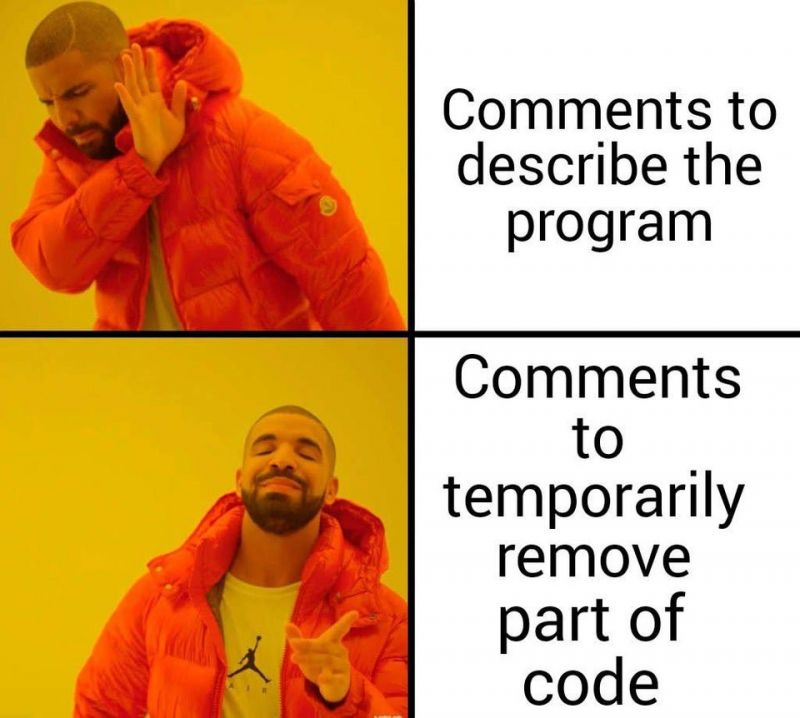
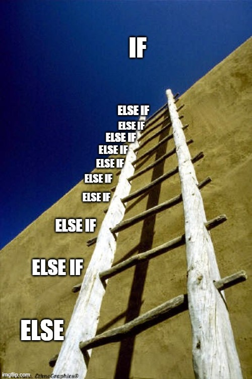

# Představení syntaxe (programovací okénko)
Projdeme si základy programování a ukážeme si, jak se stejný kód napíše i v dalších programovacích jazycích.
V tomto návodu se budeme snažit nové funkce kombinovt s již představenými

## Vypsání textu
Vypsání textu je jedna z nejzákladnějších funkcí, kterou musí jazyk podporovat. Používá se to např. pro upozornění o průběhu programu, nebo při hledání chyb

### Program vypíše "Ahoj světe"
Python
``` python
print('Ahoj světe')
```
Javascript
``` javascript
console.log('Ahoj světe')
```
LISP
``` lisp
(chat-to-all "Ahoj, světe!")
```
## Proměnné (konstanty)
Proměnné se využívájí pro záznam hodnoty. Hodnota může v AoE2 v zásadě nabývat jen jednoho typu- číslo.

### Program využívající konstanty
``` python
konstanta = 5
print('Tohle je moje konstanta: ' + str(konstanta))
```
Javascript
``` javascript
const konstanta = 5
console.log('Tohle je moje konstanta: ' + konstanta)
```
LISP
``` lisp
(defconst konstanta 5)
...
(up-chat-data-to-all "Tohle je moje konstanta: %d" c: promena)
```

## Komentáře
Komentáře slouží (mají sloužit) pro upřesnění / vysvětlení kódu například pro budoucí čtení, nebo pokud kód čte někdo, kdo ho nepsal. Převážně se ale používají pro *zakomentování* kódu

Python
``` python
print('Ahoj světe') #Tohle pozdraví svět
```
Javascript
``` javascript
console.log('Ahoj světe') //Tohle pozdraví svět
```
LISP
``` lisp
(chat-to-all "Ahoj, světe!") ;Tohle pozdraví svět
```

## Podmínky
Tohle se využívá, pokud chci spustit určitý kód pouze za určitých podmínek, tzn. ne vždy.
Např. pokud třeba jsem v určitém věku, nebo mám určitý počet lidí.

V AoE2 scriptu se za pomocí podmínek definují pravidla, která jsou **stěžejní** pro vytváření AI scriptu


Python
``` python
pocet_lidi = 5

if (pocet_lidi == 5):
    print("Mám 5 lidí")
elif (pocet_lidi > 5):
    print("Mám víc jak 5 lidí")
else:
    print("Mám míň jak 5 lidí")
```
Javascript
``` javascript
let pocetLidi = 3

if (pocetLidi == 5){
    print("Mám 5 lidí")
}
else if (pocetLidi > 5){
    print("Mám víc jak 5 lidí")
}
else{
    print("Mám míň jak 5 lidí")
}
```
LISP
``` lisp
(defrule
    (civilian-population == 5)
=>
    (chat-to-all "Mám 5 lidí")
)

(defrule
    (civilian-population > 5)
=>
    (chat-to-all "Mám víc jak 5 lidí")
)

(defrule
    (civilian-population < 5)
=>
    (chat-to-all "Mám míň jak 5 lidí")
)
```

### Operátory
- == Rovno (pokud se proměnná rovná)
```lisp
(civilian-population == 1) => (chat-to-all "Mám jednoho člověka")
```
- <= Méně nebo rovno (pokud je proměnná menší nebo rovna)
```lisp
(civilian-population <= 1) => (chat-to-all "Nemám žádného člověka")
```
- \>= Více nebo rovno (pokud je proměnná větší nebo rovna)
```lisp
(civilian-population >= 1) => (chat-to-all "Mám víc lidí")
```

### Logické operátory

NOT = negace | (a = ^b)

| a | b |
|---|---|
| 0 | 1 |
| 1 | 0 |

```lisp
not(civilian-population < 1)
```

OR = logický součet (a = b | c)

| a | b | c |
|---|---|---|
| 0 | 0 | 0 |
| 1 | 1 | 0 |
| 1 | 0 | 1 |
| 1 | 1 | 1 |

```lisp
or((civilian-population < 1) (current-age == dark-age))
```

AND = logický součin (a = b & c)

| a | b | c |
|---|---|---|
| 0 | 0 | 0 |
| 0 | 1 | 0 |
| 0 | 0 | 1 |
| 1 | 1 | 1 |

```lisp
and((civilian-population < 1) (current-age == dark-age))
```

...

## Časovač
Slouží pokud chci počkat X sekund před spuštěním akce, nebo pokud chci nějakou akci provádět každých X sekund

Javascript
``` javascript
setInterval(() => {
    jdiDoBoje()
}, 120000)
```
LISP
``` lisp
; Každé 2 minuty zaútoč
(defrule
    (true)
=>
    (enable-timer 1 120)
    (disable-self)
)

(defrule
    (timer-triggered 1)
=>
    (disable-timer 1)
    (attack-now)
    (enable-timer 1 120)
)
```